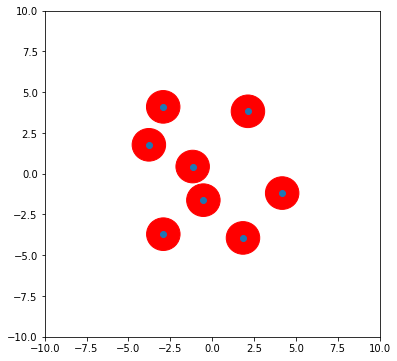
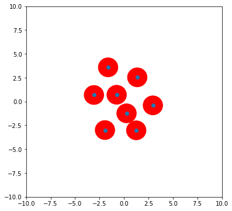

# Problem I 


# Problem II
```
mcc -W cpplib:libMyLinprog -T link:lib mylinprog -C

./build.sh
./MainSinApp
```


# Problem III
```bash
python problem3.py
```








---
This is work is made by me, ltk and qyl.
